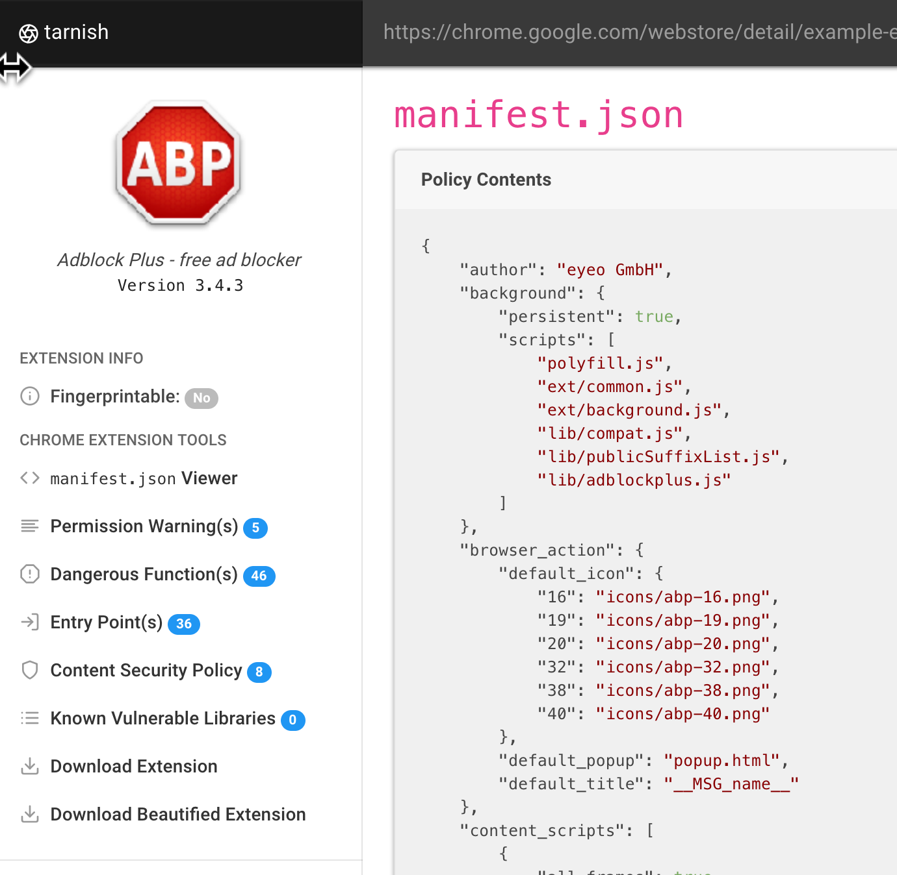

# tarnish

`tarnish` is a static-analysis tool to aid researchers in security reviews of Chrome extensions. It automates much of the regular grunt work and helps you quickly identify potential security vulnerabilities. This tool accompanies the research blog post which can be found [here](https://thehackerblog.com/kicking-the-rims-a-guide-for-securely-writing-and-auditing-chrome-extensions/index.html). If you don't want to go through the trouble of setting this up you can just use the tool at [`https://thehackerblog.com/tarnish/`](https://thehackerblog.com/tarnish/).



## Unpolished Notice & Notes

It should be noted that this is an un-polished release. This is the same source as the deployment located at [`https://thehackerblog.com/tarnish/`](https://thehackerblog.com/tarnish/). In the future I may clean this up and make it much easier to run but I don't have time right now.

To set this up you'll need to understand how to:

* Configure an S3 bucket
* (if using auto-scaling) Set up ElasticBeanstalk
* Use `docker-compose`
* Set up redis

The set up is a little complex due to a few design goals:

* Effectively perform static against Chrome extensions
* Automatically scale up to increased workload with more instances and scale down.
* Work on a shoestring budget (thus the use of ElasticBeanstalk with Spot Instances).

Some quick notes to help someone attempting to set this up:

* `tarnish` makes use of Python Celery for analysis of extensions.
* The Python Celery config uses redis as a broker (this will have to be created).
*  The workers which process extension analysis jobs run on AWS ElasticBeanstalk spot instances. For those unfamiliar, spot instances are basically bidding on unused compute. This allows the service to run super cheaply.
* The workers require at least an AWS `t2.medium` instance to operate.
* The `tarnish` frontend is just a set of static files which is upload to a static web host configured S3 bucket.

See the `docker-compose.yaml.example` for the environment variable configs. Ideally you'd run `./start.sh` and navigate to the static frontend to get things running. You can use S3 for the static site or just a simple static webserver like `python -m SimpleHTTPServer` (you'll have to modify the JavaScript files to ensure origin matches, etc.

## Features
Pulls any Chrome extension from a provided Chrome webstore link.

* `manifest.json` viewer: simply displays a JSON-prettified version of the extension’s manifest.
* Fingerprint Analysis: Detection of `web_accessible_resources` and automatic generation of Chrome extension fingerprinting JavaScript.
* Potential Clickjacking Analysis: Detection of extension HTML pages with the `web_accessible_resources` directive set. These are potentially vulnerable to clickjacking depending on the purpose of the pages.
* Permission Warning(s) viewer: which shows a list of all the Chrome permission prompt warnings which will be displayed upon a user attempting to install the extension.
* Dangerous Function(s): shows the location of dangerous functions which could potentially be exploited by an attacker (e.g. functions such as innerHTML, chrome.tabs.executeScript).
* Entry Point(s): shows where the extension takes in user/external input. This is useful for understanding an extension’s surface area and looking for potential points to send maliciously-crafted data to the extension.
* Both the Dangerous Function(s) and Entry Point(s) scanners have the following for their generated alerts:
	* Relevant code snippet and line that caused the alert.
	* Description of the issue.
	* A “View File” button to view the full source file containing the code.
	* The path of the alerted file.
	* The full Chrome extension URI of the alerted file.
	* The type of file it is, such as a Background Page script, Content Script, Browser Action, etc.
	* If the vulnerable line is in a JavaScript file, the paths of all of the pages where it is included as well as these page’s type, and `web_accessible_resource` status.
* Content Security Policy (CSP) analyzer and bypass checker: This will point out weaknesses in your extension’s CSP and will also illuminate any potential ways to bypass your CSP due to whitelisted CDNs, etc.
* Known Vulnerable Libraries: This uses Retire.js to check for any usage of known-vulnerable JavaScript libraries.
* Download extension and formatted versions.
* Download the original extension.
* Download a beautified version of the extension (auto prettified HTML and JavaScript).
* Automatic caching of scan results, running an extension scan will take a good amount of time the first time you run it. However the second time, assuming the extension hasn’t been updated, will be almost instant due to the results being cached.
Linkable Report URLs, easily link someone else to an extension report generated by tarnish.

## Tarnish using local disk storage instead of S3.

### Pre-requisite Steps:

1.  Set host.docker.internal to 127.0.0.1 in /etc/hosts. I'd do this in a
    separate line than localhost, otherwise it'll get overwritten.

```bash
127.0.0.1 localhost
127.0.0.1 host.docker.internal
```

1.  Run an upload/download server on your host. The s3 client function is
    configured to use the `multipart/form-data` upload format and has only
    tested with [updog](https://github.com/sc0tfree/updog)
    -   Run `python3 auto_tarnish <extension_id>` to setup folders and files in
        the directory you are running updog on.
    -   Update `server_dir` in docker-compose.yaml to the running directory of
        this server. This wouldn't be needed with better upload/download server.
2.  Run a local redis instance. (e.g. `docker run --name my-redis -p 6379:6379
    -d redis`)
3.  Ignore CORS errors in your browser. This can be done by
    [chrome extension](https://addons.mozilla.org/en-US/firefox/addon/cors-everywhere/)
    or cmdline flag (e.g. `google-chrome --disable-web-security`). (again, this
    would be solved with a better upload/download server)

To run:

1.  Start your local server on port 8080
2.  `./start.sh`
